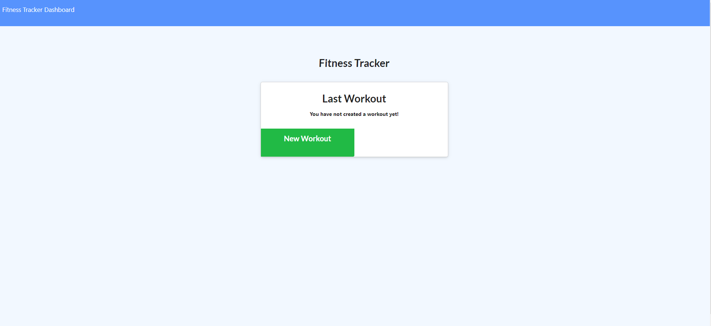
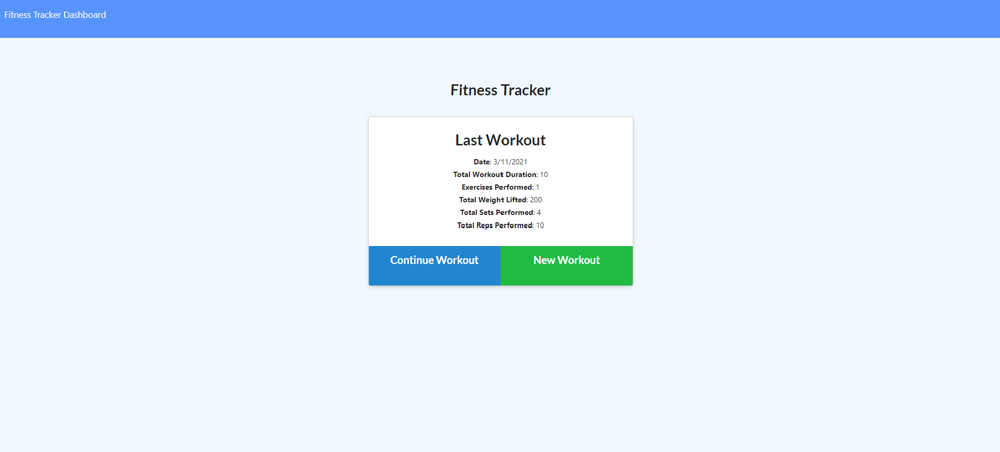
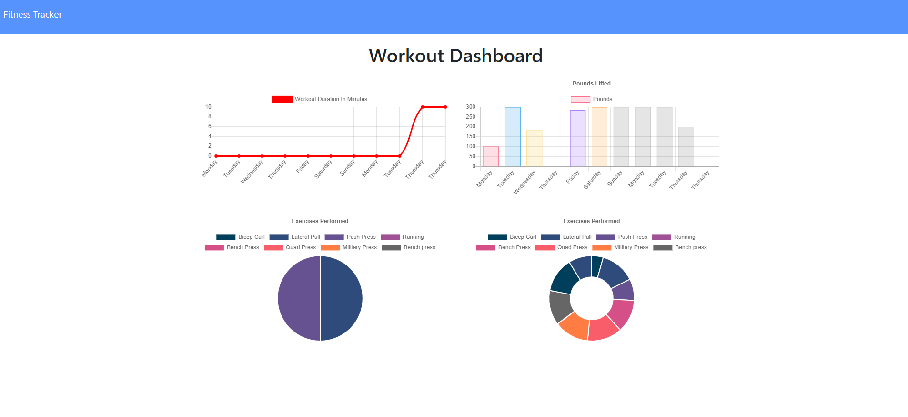

<h1 align="center"> Workout-Tracker👋</h1>

 

## Description 

The Fitness Tracker is an app which allows the user to add exercises to a database, and also view a page which displays summary data on the last seven workouts.

The app interacts with a database containing "Workout" objects, and each Workout contains an array of "Exercises." The home page of the app allows the user to choose either to begin a new Workout or continue with the most recent Workout in the database.<h4>Click [here](https://quiet-fjord-49464.herokuapp.com) for deployed application.</h4>

## ✨Demo

 ## Table of Contents
* [Description](#Description)
* [Installation](#installation)
* [Usage](#usage)
* [license](#license)

## Installation
*Steps required to install project and how to get the development environment running:*

    1- Clone this repository to your local machine.

    2- Run npm install to install dependencies required for this project.

    3-Run node server.js to start the application.

## 💻usage
*Instructions and examples for use:*  

    Create a new workout or add to an existing workout.

    Choose workout type from resistance or cardio.

    Fill out exercise details and add it to ongoing workout or mark it complete.

    View your progress over time on the dashboard and current stats on the homepage.
    
## Features

    Bootstrap - CSS framework 
    JavaScript library 
    Express - Node Framework 
    Heroku - Used to deploy application
    MongoDB Atlas

## 📝License
MIT License 
       

## Questions
 :octocat: Find me on GitHub:[shiva-shiva](https://github.com/shiva-shiva) 
     
    ✉️ Email me with any questions: shivasabokdast@gmail.com  